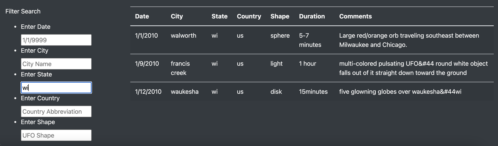
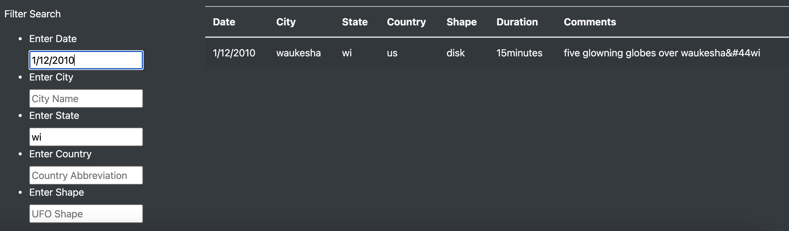

# 11UFO Sighting Analysis
# Overview of Analysis

## Purpose
This project was essentially about manipulating Javascript in order display UFO sighting data on a dynamic webpage. I focused on creating a website that allowed users to input certain search criteria and based on that search criteria, I adjusted and displayed the data back to the user. This webpage was developed by inserting Javascript into an HTML document and styled using CSS and Bootstrap.

# Results

## Using Search Criteria
While on this website, the user has 5 seperate options to filter the data by

1. Date
2. City
3. State
4. Country
5. UFO Shape

This allows the user to view the data in a great deal of ways. Below are just a couple

Here, the user filter the UFO data by State. As you can see, the only UFO data is from Wisconsin.

Here, the user has used two filters, Wisconsin and the data 1/12/2010

# Summary

## Drawback
The most glaring drawback of this website is that is no "clear filter" button. Its unnecissarily cumbersome on the user for them to have to clear each search box every time they'd like to restart their search.

## Recommendation
A nice feature to add to this site would be the ability to search for multiple criterias of the same type. For example, the user would be able to search for UFO sightings from three seperate states at the same time.

