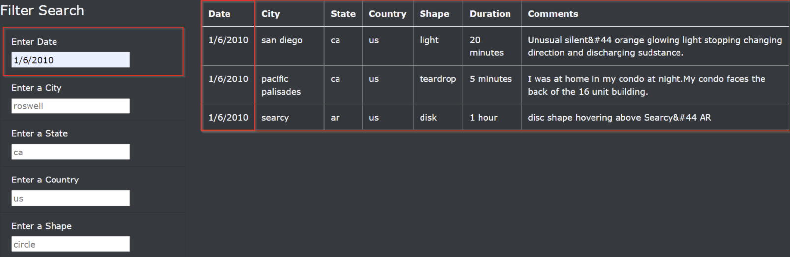
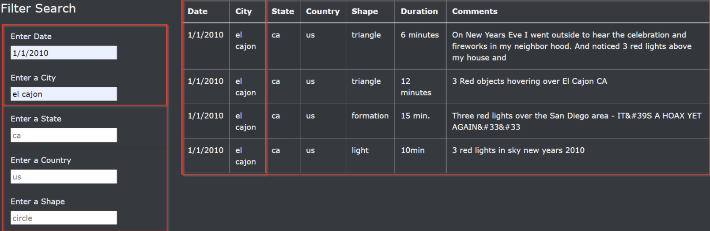
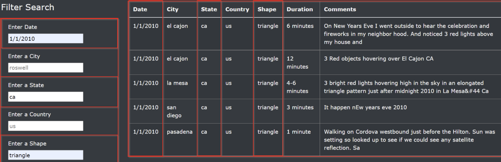
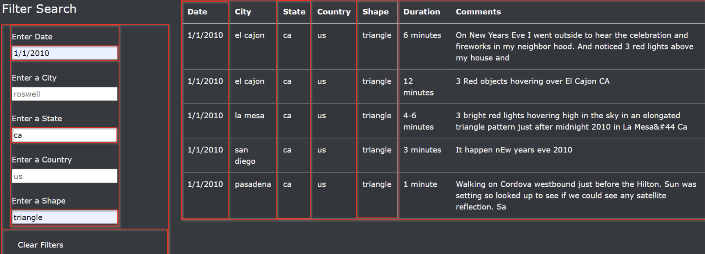
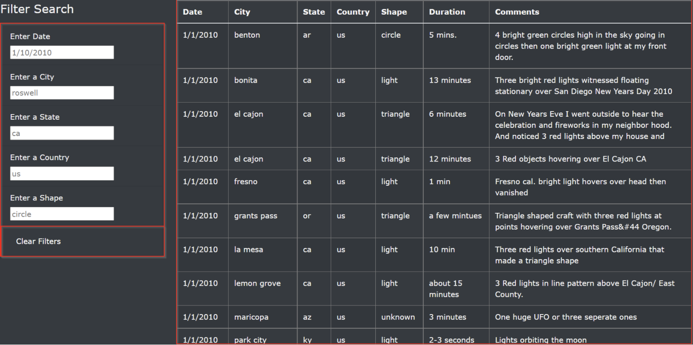

# UFOs
# Overview
This project is about using Javascript to create dynamic web content. We would focus on creating a dashboard that accepts user input and visually adjusts to reflect the user interaction. We would build the dynamic dashboard by inserting JavaScript into an HTML page. We would also draw on CSS and Bootstrap to develop and style the HTML page and explore some chrome Dev tools to test code as the development gets along.

We start by building a table to hold and display the UFO data from a JavaScript file, then add filters to the table, which lets users refine their search on multiple levels. For location-based data, for example, a user could choose to view results located in certain countries or even cities. The table will be inserted into and visually displayed by an HTML page. We also include an attention-grabbing header, article summary, and brief article. In the end, we will have built a presentation that is both visually appealing and interactive.

## Control Flow
1. Implement a folder structure
   - Create the index.html file
   - Create the index.html file
   - Create a subfolder for images.
   - Create a subfolder to hold JavaScript.
2. Create a storyboard to show conceptually what the final webpage will look like
3. Align the code to the storyboard
4. Convert the array in the data.js file to an HTML table by looping using ForEach and appending the data rows using Object.values
     - The code to read our data.js file will reside in an app.js file
       - Both data.js and app.js will reside in our JavaScript subfolder
5. Implement a function to dynamically filter the UFO sightings data on multiple criteria.
6. Build the Webpage and add the data.js, app.js, and the D3.js library

## Results
### Using the Search Criteria
A user may filter the UFO sightings data on one or multiple filters. A filter search panel with five filter options is available to the left of the table data.

##### Filter on a single level
Here the user enters only one search parameter as shown in the image.

##### Filter on multiple levels
The user amy enter multiple search parameters at the same time and get the desired results.

## Summary
#### Drawback 1
A drawback of this implementation is the absence of a clear filters button. Everytime the user does a multi-level search, the page will have to refreshed to clear all filters. 

#### Recommendation 
With a clear filters button, all previously entered search parameters are cleared at the click of a button.

A "Clear Filters" button is implemented as shown below:
##### When the user clciks the Clear Filters button, all search parameters are cleared and the data is reset

##### Page with Cleared Filters: The Clear Filters button clears all filters and resets the data.

#### Drawback 2
Another drawback is: how the search returns only exact matches. In a scenario where the user knows only part of the name of a city, for example, our search will not return any results. If a city name was "el cajon," entering only "cajon" will not return any results. 
#### Recommendation
If we implemented JavaScript's indexOf method, we would match more nuanced user searches and return results when users enter "cajon" instead of "el cajon."
